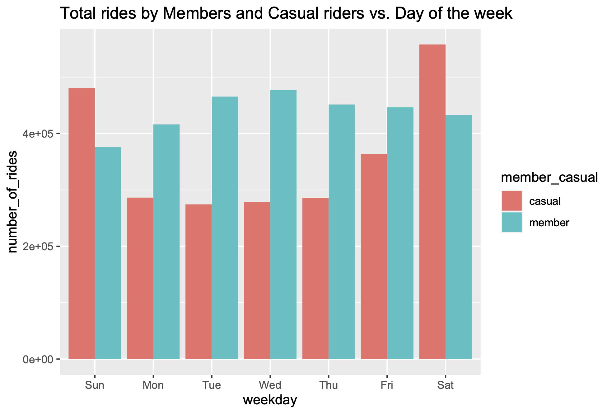
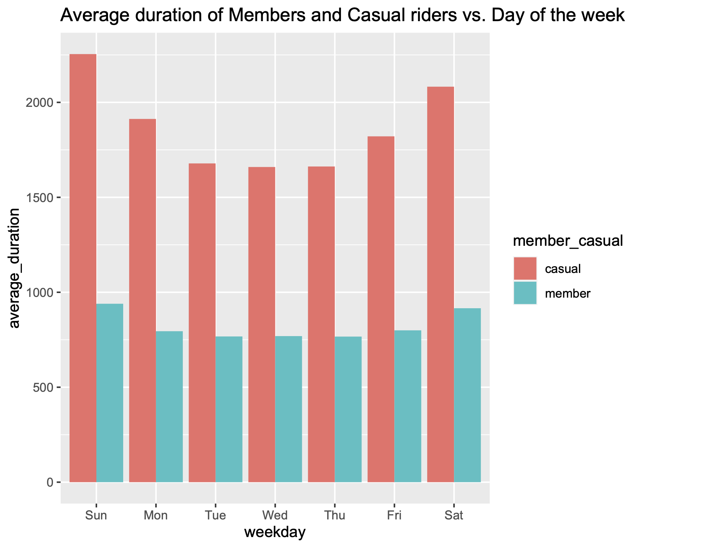
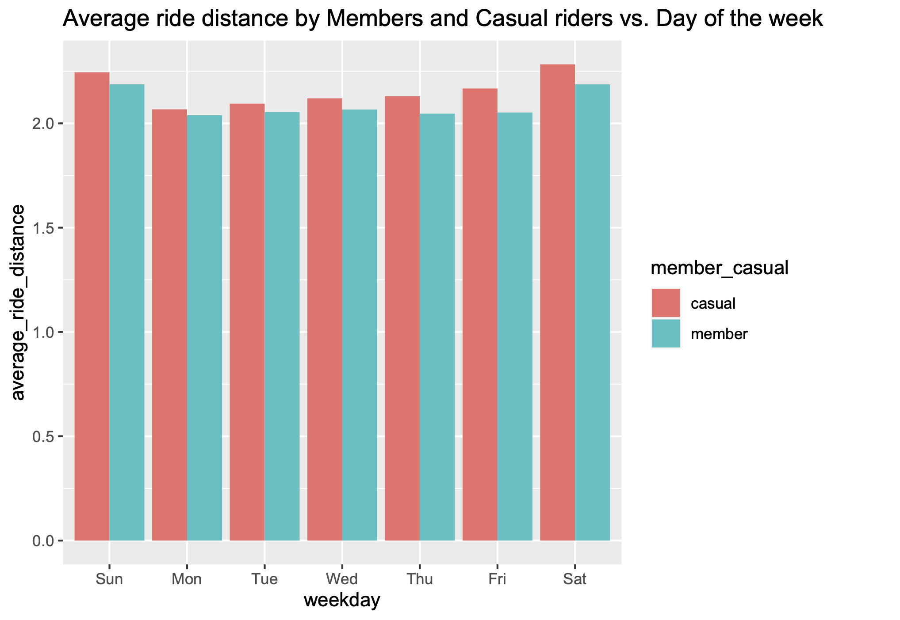
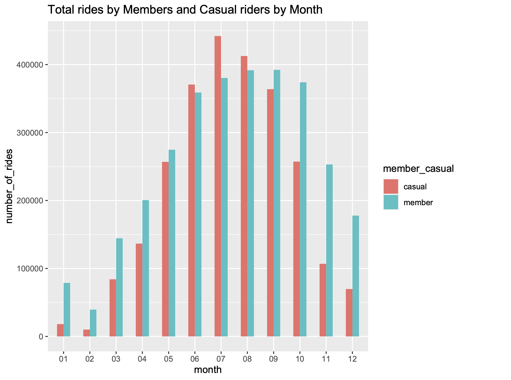
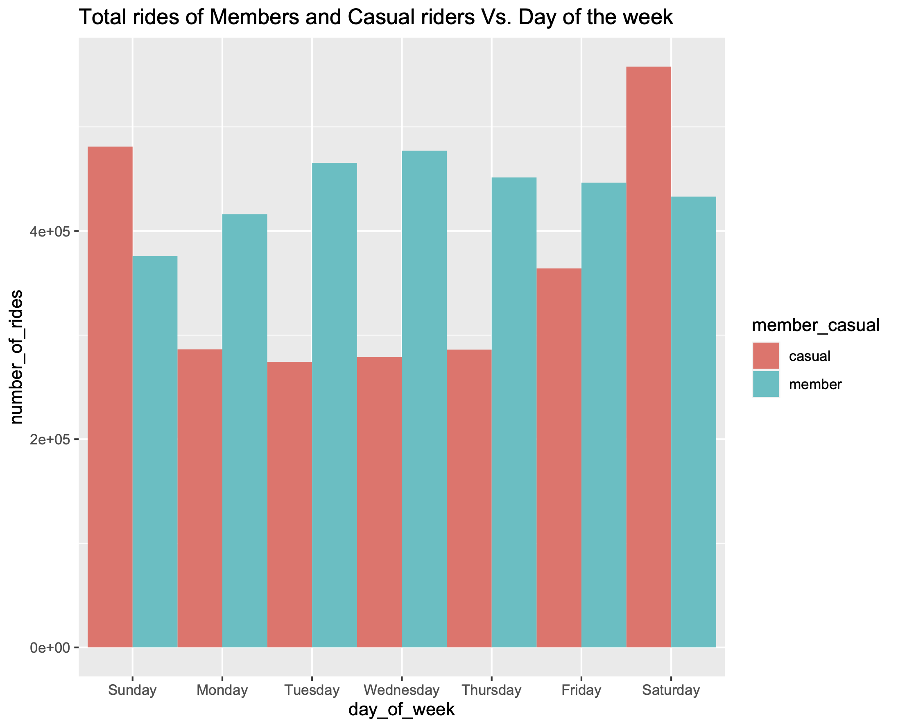
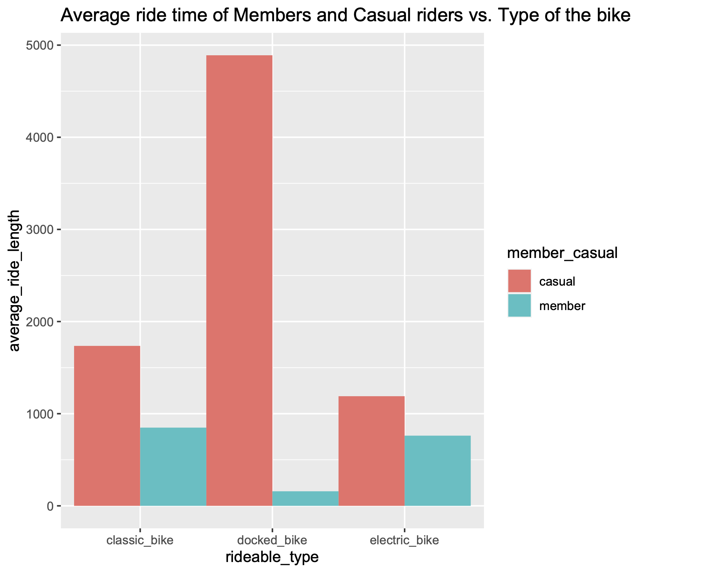
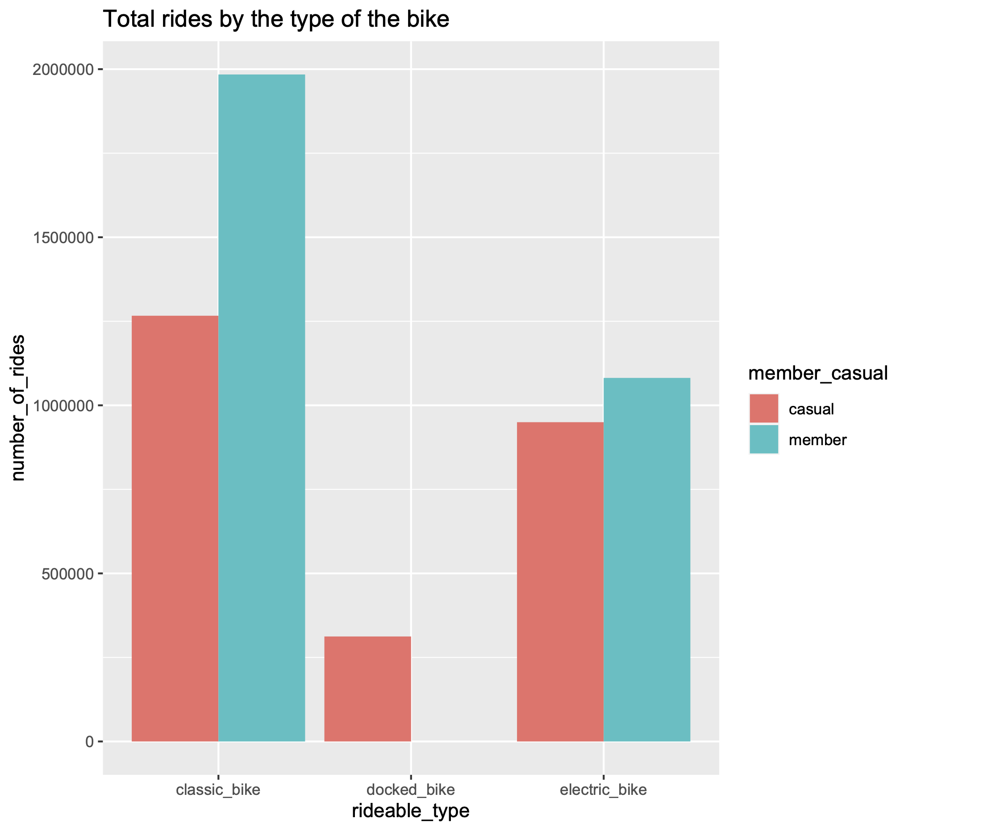

# Introduction

This is a case study for my Google Data Analytics certificate course. In this case study I analyze a public data set about a bike-share company in Chicago. This document describes six steps of the data analysis process: ask, prepare, process, analyze, share, and act.

## Scenario

A junior data analyst working in the marketing analyst team at Cyclistic, a bike-share company in Chicago. The director of marketing believes the company’s future success depends on maximizing the number of annual memberships. Therefore, a team wants to understand how casual riders and annual members use Cyclistic bikes differently. From these insights, the team will design a new marketing strategy to convert casual riders into annual members. But first, Cyclistic executives must approve recommendations, so they must be backed up with compelling data insights and professional data visualizations.

## Step 1: Ask

Three questions will guide the future marketing program:

* How do annual members and casual riders use Cyclistic bikes differently?
* Why would casual riders buy Cyclistic annual memberships?
* How can Cyclistic use digital media to influence casual riders to become members?

The director of marketing and your manager has assigned the first question to answer: How do annual members and casual riders use Cyclistic bikes differently?

### Key tasks

Identify the business task. Analyze the 12 months of Cyclistic customer data, find the difference between annual members and casual riders and compose marketing program for converting casual riders to annual members.

Consider key stakeholders. Director of Marketing, marketing analytics team, executive team.

Deliverable: A list of differences between the casual riders and annual members.

## Step 2: Prepare

Cyclistic’s historical trip data for 2021 was used to analyze and identify trends and explore how different customer types are using Cyclistic bikes. The data was made available by Motivate International Inc. under this [license](https://ride.divvybikes.com/data-license-agreement). 

### Key tasks

Download data and store it appropriately. The Data has been downloaded and have been stored on my computer. The data is located in public dataset divvy-tripdata [link](https://divvy-tripdata.s3.amazonaws.com/index.html).

Identify how it’s organized. The data stored in CSV files, and there are a total of 13 columns in each files. The data is provided by a third-party called Motivate International Inc.

Sort and filter the data. 12 months of data from 2021 was used for this analysis. The data has a large sample size, more than million rows in total.

Determine the credibility of the data. Data-privacy issues prohibit me from using riders’ personally identifiable information and I can't determine if riders have purchased multiple single passes.

Deliverable: A description of all data sources used.

## Step 3: Process

### Key tasks

Check the data for errors. Сheck for duplicates, inconsistencies. 

Choose your tools. Use the R programming language because the data set has more than a million rows in total.

Transform the data to work with it effectively. Merge all 12 csv files into one. 

Document the cleaning process. Create a document for all steps of the process.

Deliverable: Documentation of any cleaning or manipulation of data.

### Install and load necessary packages in R

Install and load necessary packages in R

```{r}
install.packages("tidyverse")
install.packages("lubridate")
install.packages("ggplot2")
install.packages("dplyr")
install.packages("readr")
install.packages("magrittr")
install.packages("geosphere")

library(tidyverse)
library(lubridate)
library(ggplot2)
library(dplyr)
library(readr)
library(magrittr)
library(geosphere)
getwd() # Displays your working directory
setwd("/Users/...) # Sets your working directory to simplify calls to data
```
#### Import data to R studio:

```{r}
m01_2021 <- read_csv("Divvy_Trips_2021_01.csv")
m02_2021 <- read_csv("Divvy_Trips_2021_02.csv")
m03_2021 <- read_csv("Divvy_Trips_2021_03.csv")
m04_2021 <- read_csv("Divvy_Trips_2021_04.csv")
m05_2021 <- read_csv("Divvy_Trips_2021_05.csv")
m06_2021 <- read_csv("Divvy_Trips_2021_06.csv")
m07_2021 <- read_csv("Divvy_Trips_2021_07.csv")
m08_2021 <- read_csv("Divvy_Trips_2021_08.csv")
m09_2021 <- read_csv("Divvy_Trips_2021_09.csv")
m10_2021 <- read_csv("Divvy_Trips_2021_10.csv")
m11_2021 <- read_csv("Divvy_Trips_2021_11.csv")
m12_2021 <- read_csv("Divvy_Trips_2021_12.csv")
```

#### Compare all column names of each of the files. 

If column names is different, rename column name  to make them consistent:
```{r}
colnames(m01_2021)
colnames(m02_2021)
colnames(m03_2021)
colnames(m04_2021)
colnames(m05_2021)
colnames(m06_2021)
colnames(m07_2021)
colnames(m08_2021)
colnames(m09_2021)
colnames(m10_2021)
colnames(m11_2021)
colnames(m12_2021)
```
#### Check that all the data sets have the same number of columns, same type of columns and names:
```{r}
str(m01_2021)
str(m02_2021)
str(m03_2021)
str(m04_2021)
str(m05_2021)
str(m06_2021)
str(m07_2021)
str(m08_2021)
str(m09_2021)
str(m10_2021)
str(m11_2021)
str(m12_2021)
```
#### Merge all files in one and inspect for inconsistencies:
```{r}
all_trips_2021 <- bind_rows(m01_2021,m02_2021,m03_2021,m04_2021,m05_2021,m06_2021,m07_2021,m08_2021,m09_2021,m10_2021,m11_2021,m12_2021)
```
#### Statistical summary of data:
```{r}
str(all_trips_2021) # List of columns and data types
colnames(all_trips_2021) # List of column names
dim(all_trips_2021) # Dimensions of the data frame
head(all_trips_2021) # The first 6 rows of the data frame
tail(all_trips_2021) # The last 6 rows of the data frame
summary(all_trips_2021) # Statistical summary of data
all_trips_2021 %>% distinct() # Remove duplicate rows in the data frame
```
#### Add columns for date, month, year, day of the week into the data frame:
```{r}
all_trips_2021$date <- as.Date(all_trips_2021$started_at)
all_trips_2021$month <- format(as.Date(all_trips_2021$date), "%m")
all_trips_2021$day <- format(as.Date(all_trips_2021$date), "%d")
all_trips_2021$year <- format(as.Date(all_trips_2021$date), "%Y")
all_trips_2021$day_of_week <- format(as.Date(all_trips_2021$date), "%A")

colnames(all_trips_2021) # Check the names of all the columns in the data frame
```
#### Add a new columns:  

Add a "ride_length" calculation to the data frame:
```{r}
all_trips_2021$ride_length <- difftime(all_trips_2021$ended_at,all_trips_2021$started_at)
str(all_trips_2021) #Check the structure of the columns
is.factor(all_trips_2021$ride_length) # Check if the object passed to the function is a Factor or not
all_trips_2021$ride_length <- as.numeric(as.character(all_trips_2021$ride_length)) # Convert "ride_length" from Factor to numeric
is.numeric(all_trips_2021$ride_length) # Check if the values are regarded as numeric
```

The data frame includes a few hundred entries when bikes were taken out of docks and checked for quality by Divvy. Otherwise a ride length is negative or "0":

```{r}
all_trips_2021_v2 <- all_trips_2021[!(all_trips_2021$ride_length <= 0),]
```

Add ride_distance calculation in km to the data frame:
```{r}
all_trips_2021_v2$ride_distance <- distGeo(matrix(c(all_trips_2021_v2$start_lng, all_trips_2021_v2$start_lat), ncol=2), matrix (c(all_trips_2021_v2$end_lng, all_trips_2021_v2$end_lat), ncol=2))
all_trips_2021_v2$ride_distance <- all_trips_2021_v2$ride_distance/1000 # Set ride_distance in km
```

## Step 4: Analysis

### Key tasks

Aggregate the data so it’s useful and accessible.

Organize and format the data.

Perform calculations.

Identify trends and relationships.

Deliverable: A summary of data analysis.

### Conduct descriptive analysis:

#### Descriptive analysis on column 'ride_length':

```{r}
mean(all_trips_2021_v2$ride_length) # The straight average (total ride length / rides)
median(all_trips_2021_v2$ride_length) # The midpoint number in the ascending array of ride lengths
max(all_trips_2021_v2$ride_length) # The longest ride
min(all_trips_2021_v2$ride_length) # The shortest ride
```

#### Compare members and casual users:
```{r}
aggregate(all_trips_2021_v2$ride_length ~ all_trips_2021_v2$member_casual, FUN = mean)
aggregate(all_trips_2021_v2$ride_length ~ all_trips_2021_v2$member_casual, FUN = median)
aggregate(all_trips_2021_v2$ride_length ~ all_trips_2021_v2$member_casual, FUN = max)
aggregate(all_trips_2021_v2$ride_length ~ all_trips_2021_v2$member_casual, FUN = min)
aggregate(all_trips_2021_v2$ride_length ~ all_trips_2021_v2$member_casual + all_trips_2021_v2$day_of_week, FUN = mean) # The average ride time by each day for members vs casual users

all_trips_2021_v2$day_of_week <- ordered(all_trips_2021_v2$day_of_week, levels=c("Sunday", "Monday", "Tuesday", "Wednesday", "Thursday", "Friday", "Saturday")) # Set the order for the column 'day_of_week'

aggregate(all_trips_2021_v2$ride_length ~ all_trips_2021_v2$member_casual + all_trips_2021_v2$day_of_week, FUN = mean) # The right order of the column 'day_of_week'
```

#### Analyze ridership data by type and weekday:
```{r}
all_trips_2021_v2 %>% 
    mutate(weekday = wday(started_at, label = TRUE)) %>% # Creates weekday field using wday()
    group_by(member_casual, weekday) %>% # G roups by usertype and weekday
    summarise(number_of_rides = n() #The number of rides and average duration
    ,average_duration = mean(ride_length))  %>% # The average duration
    arrange(member_casual, weekday) #Sort

all_trips_2021_v2 %>% 
    mutate(weekday = wday(started_at, label = TRUE)) %>% 
    group_by(member_casual, weekday) %>% 
    summarise(number_of_rides = n()     
    ,average_ride_length = mean(ride_length),.groups="drop") %>%
    arrange(member_casual, weekday)
```
## Step 5: Share

### Key tasks

Determine the best way to share your findings. Share findings in the presentation. 

Create effective data visualizations. Compose plots in R Studio. 

Present findings. Prepared the presentation with all findings.

Ensure the result is accessible. Check visualization for accessibility. 

Deliverable: Supporting visualizations and key findings.

### Key findings summary:

* Members of Cyclistic use bikes more on weekdays.
* Casual riders are more active on the weekends.
* Casual riders rent for longer periods of time than members.
* June to September is the most popular season to rent a bike.
* A ride distance increases on weekends for both groups.

### Visualizing the number of rides by rider type:
```{r}
#plot_1
all_trips_2021_v2 %>% 
    mutate(weekday = wday(started_at, label = TRUE)) %>% 
    group_by(member_casual, weekday) %>% 
    summarise(number_of_rides = n()
              ,average_duration = mean(ride_length)) %>% 
    arrange(member_casual, weekday)  %>% 
    ggplot(aes(x = weekday, y = number_of_rides, fill = member_casual)) +
    geom_col(position = "dodge")+
    labs(title="Total rides by Members and Casual riders vs. Day of the week")
```




```{r}
#plot_2
all_trips_2021_v2 %>% 
    mutate(weekday = wday(started_at, label = TRUE)) %>% 
    group_by(member_casual, weekday) %>% 
    summarise(number_of_rides = n()
              ,average_duration = mean(ride_length)) %>% 
    arrange(member_casual, weekday)  %>% 
    ggplot(aes(x = weekday, y = average_duration, fill = member_casual)) +
    geom_col(position = "dodge")+
    labs(title="Average duration of Members and Casual riders vs. Day of the week")
```


```{r}
#plot_3
all_trips_2021_v2 %>% 
    mutate(weekday = wday(started_at, label = TRUE)) %>% 
    group_by(member_casual, weekday) %>% drop_na() %>%
    summarise(average_ride_distance = mean(ride_distance)) %>% 
    ggplot(aes(x = weekday, y = average_ride_distance, fill = member_casual)) +
    geom_col(position = "dodge")+
    labs(title="Average ride distance by Members and Casual riders vs. Day of the week")
```


```{r}
#plot_4
all_trips_2021_v2 %>%  
  group_by(member_casual, month) %>% 
  summarise(number_of_rides = n(),.groups="drop") %>% 
  arrange(member_casual, month)  %>% 
  ggplot(aes(x = month, y = number_of_rides, fill = member_casual)) +
  labs(title ="Total rides by Members and Casual riders by Month") +
  geom_col(width=0.5, position = position_dodge(width=0.5)) +
  scale_y_continuous(labels = function(x) format(x, scientific = FALSE))
```


```{r}
#plot_5
all_trips_2021_v2 %>%   
    group_by(member_casual, day_of_week) %>% 
    summarise(number_of_rides = n(), .groups="drop") %>% 
    arrange(member_casual, day_of_week) %>% 
    ggplot(aes(x = day_of_week, y = number_of_rides, fill = member_casual)) +
    labs(title ="Total rides of Members and Casual riders Vs. Day of the week") +
    geom_col(width=1, position = position_dodge(width=1))
```


```{r}
#plot_6
all_trips_2021_v2 %>%  
  group_by(member_casual, rideable_type) %>% 
  summarise(average_ride_length = mean(ride_length), .groups="drop") %>%
  ggplot(aes(x = rideable_type, y = average_ride_length, fill = member_casual)) +
  geom_col(width=1, position = position_dodge(width=1)) + 
  labs(title ="Average ride time of Members and Casual riders vs. Type of the bike")
```


```{r}
#plot_7
all_trips_2021_v2 %>% 
    group_by(member_casual, rideable_type) %>% 
    summarise(number_of_rides = n()
              ,average_duration = mean(ride_length)) %>% 
    arrange(rideable_type) %>% 
    ggplot(aes(x = rideable_type, y = number_of_rides, fill = member_casual)) +
    geom_col(position = "dodge")+
    labs(title="Total rides by the type of the bike")
```


## Step 6: Act
Prepare the presentation with the top three recommendations based on the analysis.

### Key tasks

Solve the problem.

Apply insights.

Make a data-driven decision.

Deliverable: The top three recommendations based on your analysis.

### Recommendations:

* Add seasonal rates with privileges for member riders.
* Provide discounts on weekends with membership.
* Prepare a loyalty program to encourage members to ride on weekends and longer distances.
* Continue to collect data including demographics for future analysis.
